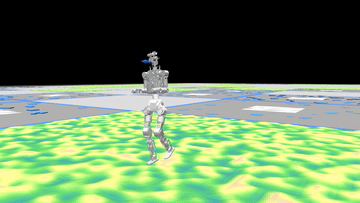
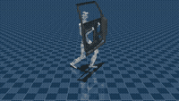

# VinRobotics RL MjLab

[](LICENSE.md)
[](https://github.com/mujocolab/mjlab.git)

A reinforcement learning framework for legged robot locomotion, built on top of [`mjlab`](https://github.com/mujocolab/mjlab.git) with [MuJoCo](https://github.com/google-deepmind/mujoco) as the physics backend. Mjlab combines [Isaac Lab](https://github.com/isaac-sim/IsaacLab)'s proven API with GPU-accelerated [MuJoCo Warp](https://github.com/google-deepmind/mujoco_warp) physics to deliver lightweight, modular abstractions for RL robotics research and sim-to-real deployment. Currently supporting the VinRobotics M3.1.

<div align="center">

| <div align="center"> MuJoCo - Mjlab </div> | <div align="center"> MuJoCo - Sim2Sim</div> |
|---|---|
| <div style="width:250px; height:150px; overflow:hidden;"></div> | <div style="width:250px; height:150px; overflow:hidden;"></div> |

</div>

## Installation

### Prerequisites

- Python 3.8+
- CUDA 12.x (recommended for GPU-accelerated simulation)

```bash
pip install mjlab==1.4.0 mujoco==3.8.1 mujoco-warp==3.8.1 warp-lang==1.13.0
```

### From source

```bash
pip install -e .
```

To list all registered tasks at runtime:

```bash
python scripts/list_envs.py
```

> [!NOTE]
> For more details, refer to the [mjlab documentation](https://mujocolab.github.io/mjlab/index.html).

## Training

The basic workflow is `Train` -> `Play`. Run the following command to train a velocity tracking policy:

```bash
python scripts/train.py VR-M3-1-12DOF-Flat --env.scene.num-envs=4096
```

Multi-GPU training: scale to multiple GPUs using `--gpu-ids`:

```bash
python scripts/train.py VR-M3-1-12DOF-Flat \
  --gpu-ids '[0, 1]' \
  --env.scene.num-envs=4096
```

**Training results are stored at**: `logs/rsl_rl/<experiment_name>/<date_time>/model_<iteration>.pt`

### Available Tasks

| Task ID | Robot | Terrain |
|---|---|---|
| `VR-M3-1-Flat` | VR M3.1 (full body) | Flat |
| `VR-M3-1-Rough` | VR M3.1 (full body) | Rough |
| `VR-M3-1-12DOF-Flat` | VR M3.1 (lower body, 12 DOF) | Flat |
| `VR-M3-1-12DOF-Rough` | VR M3.1 (lower body, 12 DOF) | Rough |

### Parameters

| Flag | Description |
|---|---|
| `--env.scene` | Simulation scene config (`num_envs`, `dt`, ground type, gravity, disturbances) |
| `--env.observations` | Observation space config (joint state, IMU, commands) |
| `--env.rewards` | Reward terms for policy optimization |
| `--env.commands` | Task commands (e.g., velocity ranges) |
| `--env.terminations` | Episode termination conditions |
| `--agent.seed` | Random seed for reproducibility |
| `--agent.resume` | Resume from the last saved checkpoint |
| `--agent.policy` | Policy network architecture configuration |
| `--agent.algorithm` | RL algorithm config (PPO, hyperparameters, etc.) |

## Simulation Validation

To visualize policy behavior in MuJoCo:

```bash
python scripts/play.py VR-M3-1-12DOF-Flat \
  --checkpoint_file=logs/rsl_rl/vr_m3_1_12dof_velocity/2026-xx-xx_xx-xx-xx/model_xx.pt
```

> [!NOTE]
> During training, `policy.onnx` and `policy.onnx.data` are also exported alongside each checkpoint for downstream deployment.

## Deployment

Exported policies (`policy.onnx` / `policy.onnx.data`) are consumed by
[vinrobotics_mjlab_deploy](https://bitbucket.org/vinrobotics/vinrobotics_mjlab_deploy/src/main/)
for sim-to-sim deployment on the VinRobotics M3.1.

## Roadmap

Work in progress and planned directions (🚧 in progress · ⬜ planned · ✅ done):

**Locomotion Tasks**

- [x] ✅ Velocity tracking
- [ ] 🚧 Loaded locomotion
- [ ] ⬜ …and more

## Contributors / Maintainers

- [Thanh Ly](https://github.com/capfab)
- [Cuc T. Trinh](https://github.com/kookie14)
- [Chien Anh Le](https://github.com/LeAnhChien-1903)
- [Duy T. Dang](https://github.com/anakin-05)
- [Tan-Dzung Do](https://github.com/dotandung)
- [An T. Le](https://github.com/anindex)

## License

Licensed under the [Apache License, Version 2.0](LICENSE.md).

## Acknowledgements

- [unitree_rl_mjlab](https://github.com/unitreerobotics/unitree_rl_mjlab) - reference implementation for legged robot RL training with mjlab
- [mjlab](https://github.com/mujocolab/mjlab.git) - training and execution framework
- [rsl_rl](https://github.com/leggedrobotics/rsl_rl.git) - reinforcement learning algorithm implementation
- [mujoco_warp](https://github.com/google-deepmind/mujoco_warp.git) - GPU-accelerated rendering and simulation interface
- [mujoco](https://github.com/google-deepmind/mujoco.git) - high-fidelity rigid-body physics engine
